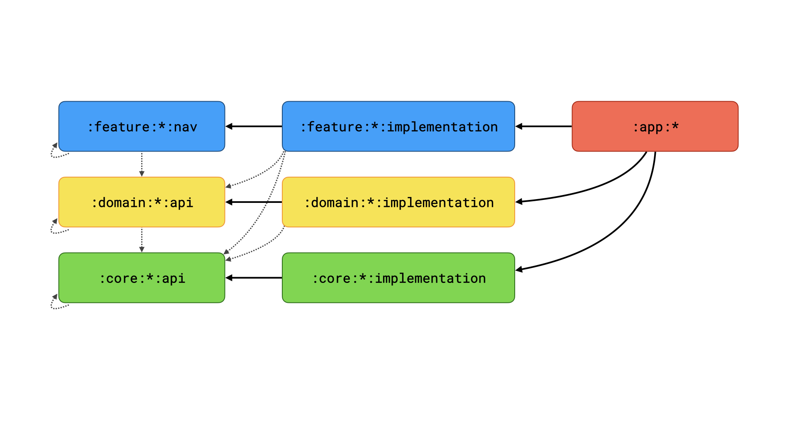

# Monorepo plugins

These plugins are used in the Freeletics monorepo. They are built on top of the same foundation as the common
plugins but are more opinionated and tailored to the structure of our code base.

## Structure

The codebase is heavily modularized and has the following groups of modules. For each group of modules there is a
specific Gradle plugin.

- `app`: The actual Android apps
    - Gradle plugin: `com.freeletics.gradle.app`
    - Should be as small as possible and generally just aggregate their dependencies
- `core`: A generic building block that can be used to build features
    - Gradle plugin: `com.freeletics.gradle.core-android` or `com.freeletics.gradle.core-kotlin`
    - Should not contain anything Freeletics specific (API clients/models, business logic, analytics)
    - Core modules are split into 2 actual modules, `core:*:api` and `core:*:implementation`. API contains only the
      parts that are used directly by other modules, which in many cases is just an interface. The implementation
      as well as potential Dagger contributions go into the implementation module. This is done to keep
      implementation classes as well as dependencies only needed by the implementation hidden from consumers of the 
      API.
- `domain`: A Freeletics specific build block that can be used to build features
    - Gradle plugin: `com.freeletics.gradle.domain-android` or `com.freeletics.gradle.domain-kotlin`
    - Very similar to `core` but with Freeletics specific code. We've split this out of `core` because the number of
      core modules got so big that it was hard to find what you wanted.
    - Domain modules have the same api/implementation split as `core` modules
- `feature:*:implementation`: A feature for the app
    - Gradle plugin: `com.freeletics.gradle.feature`
    - This is usually a single screen of the app with its UI and logic.
- `feature:*:nav`
    - Gradle plugin: `com.freeletics.gradle.nav`
    - Contains a `NavRoute` class that has all the required arguments to navigate to the screen of the corresponding
      `feature` module. Other `feature` modules can use this to navigate to it.

There are rules of which type of module is allowed on which other type:

*The dotted line means the dependency is optional and only present if needed while a regular line signifies a dependency
that always exists*

In case the monorepo contains multiple apps the `domain` and `feature` groups can be split up into multiple app specific 
groups. For that a suffix can be added with a `-` to the top level folder. The suffix should equal the name of the app 
module. For example with `:app:foo` and `:app:bar` anything inside `:domain` and `:feature` can be used by either app
while `:domain-foo` and `:feature-foo` would be for `:app:foo` and `:domain-bar` and `:feature-bar` for `:app:bar`.

Each module has a `checkDependencyRules` task that will ensure that it only depends on modules that it is allowed to 
depend on based on the rules above. This includes checks based on the module group (e.g. an `implementation` module
is not allowed to depend on another `implementation` module) and based on the app (e.g. `:app:bar` or 
`feature-bar:...:implemenetation` are not allowed to depend on a `domain-foo` module).

## General config

For the monorepo Gradle plugins to work certain Gradle properties and version catalog entries are required. 

Add the following to `gradle.properties`:
```properties
# used to automatically set `android.namespace` based on the project name
# e.g. `:foo` would use `com.example.foo` as namespace
fgp.android.namespacePrefix=com.example
```

Add the following to the `libs` version catalog:
```toml
[versions]
# the Java version that the Java and Kotlin compilers will target
java-target = "11"
# the Java version that is used to run the Java and Kotlin compilers and various other tasks
java-toolchain = "17"

# optional, the Kotlin language version to use
kotlin-language = "1.8.10"

# the Android minSdkVersion to use
android-min = "26"
# the Android target to use
android-target = "34"
# the Android compileSdkVersion to use
android-compile = "34"

[libraries]
# if this is present coreLibraryDesugaring will be enabled and this dependency is automatically added 
android-desugarjdklibs = { module = "com.android.tools:desugar_jdk_libs", version = "..." }
# default dependencies
androidx-annotations = { module = "androidx.annotation:annotation", version = "..." }
androidx-core = { module = "androidx.annotation:core-ktx", version = "..." }
timber = { module = "com.jakewharton.timber:timber", version = "..." }
```

## `app`

Applies:
- `com.android.application`
- `org.jetbrains.kotlin.android`
- `com.autonomousapps.dependency-analysis`

Includes all features described in:
- [Common: Shared Configuration](../common/README.md#shared-configuration)
- [Common: Android Library](../common/README.md#android-library-projects)

Additional features:
- enables build config, res values and android resources by default
- sets target sdk
- signing setup
- sets `applicationIdSuffix` for the `debug` build type to `.debug`
- configures lint baseline
- excludes certain files from being included in release builds
- adds default dependencies

### Android config

```groovy
freeletics {
    // the application id that will be used for the app
    applicationId("com.example")
    // sets an application id suffix for the given build type
    applicationIdSuffix("release", ".suffix")
    // resources will be limited to the given locales
    limitLanguagesTo("en", "de", "fr")
    // enable minification with R8 and use the given proguard files as additional config (parameters are optional)
    minify(
        rootProject.file("proguard/library1.pro"),
        rootProject.file("proguard/library2.pro"),
    )
}
```

### Git based versioning

When enabled the `versionName` and `versionCode` will be computed based on information from Git.
```groovy
freeletics {
    // the passed in value will be used for matching git tags and branches as described below
    // can be anything identifying an app, e.g. `fl` for `freeletics` or just `freeletics` directly
    versionFromGit("<short-app-name>")
}
```

The version information can come from:
- a tag for the current commit in the format of `<short-app-name>/v<app-version>` -> `<app-version>` is used as version name
- a branch format of `release/<short-app-name>/<app-version>` -> `<app-version>` is used as version name
- a branch format of `hotfix/<short-app-name>/<app-version>` -> `<app-version>` is used as version name
- otherwise the output of `git describe` (`<short-app-name>/v<last-app-version>-<commits-since-tag>-<current-commit-sha>`) is used which would result in `<last-app-version>-<commits-since-tag>-<current-commit-sha>`

The version code is then computed by taking the version and applying the following formula 
```md
<major> * 1_000_000 + <minor> * 10_000 + <patch> * 100 + <commits since last week sunday>
```

Also creates `BuildConfig.GIT_SHA1`, `BuildConfig.BUILD_TIMESTAMP` fields containing information from the current commit.

To not break incremental builds and build cache `versionName`, `versionCode` and the 2 build config fields will default 
to constants. The computation will only happen if `-Pfgp.computeInfoFromGit=true` is passed to the build.

### License checks

Applies [Licensee][1] (`app.cash.licensee`) and already configures it to accept `Apache-2.0`, `MIT` and `MIT-0` licenses.

```groovy
freeletics {
    checkLicenses()
}
```

This will also register a task `updateLicenses` that will copy the output of `licenseeRelease` to
`src/main/assets/license_acknowledgements.json` and strip the `version` information from that file.
This file will be shipped wit the app and can be used as data source for a license acknowledgement screen
in the app.

### Crashlytics

Applies the Crashlytics Gradle plugin and configures it for the release build type. This configuration
does not require the Google services Gradle plugin but it expects `src/debug/res/values/google-services.xml`
and `src/release/res/values/google-services.xml` to exist. The Crashlytics mapping upload will only be enabled
when `-Pfgp.computeInfoFromGit=true` is passed to the build.

```groovy
freeletics {
    crashReporting()
}
```

There will also be a generated `BuildConfig.CRASHLYTICS_ENABLED` boolean field that will only be `true` if the mapping 
upload was enabled.


## `core` (Android)

Applies:
- `com.android.library`
- `org.jetbrains.kotlin.android`
- `com.autonomousapps.dependency-analysis`

Includes all features described in:
- [Common: Shared Configuration](../common/README.md#shared-configuration)
- [Common: Android Library](../common/README.md#android-library-projects)

Additional features:
- enables parcelize
- adds default dependencies


## `core` (Kotlin)

Applies:
- `org.jetbrains.kotlin.jvm`
- `com.android.lint`
- `com.autonomousapps.dependency-analysis`

Includes all features described in:
- [Common: Shared Configuration](../common/README.md#shared-configuration)
- [Common: Kotlin Library](../common/README.md#kotlinjvm-library-projects)

Additional features:
- adds and configures Android Lint
- adds default dependencies


## `domain` (Android)

Applies:
- `com.android.library`
- `org.jetbrains.kotlin.android`
- `com.autonomousapps.dependency-analysis`

Includes all features described in:
- [Common: Shared Configuration](../common/README.md#shared-configuration)
- [Common: Android Library](../common/README.md#android-library-projects)

Additional features:
- enables parcelize
- adds default dependencies


## `domain` (Kotlin)

Applies:
- `org.jetbrains.kotlin.jvm`
- `com.android.lint`
- `com.autonomousapps.dependency-analysis`

Includes all features described in:
- [Common: Shared Configuration](../common/README.md#shared-configuration)
- [Common: Kotlin Library](../common/README.md#kotlinjvm-library-projects)

Additional features:
- adds and configures Android Lint
- adds default dependencies


## `feature:*:implementation`

Applies:
- `com.android.library`
- `org.jetbrains.kotlin.android`
- `com.autonomousapps.dependency-analysis`

Includes all features described in:
- [Common: Shared Configuration](../common/README.md#shared-configuration)
- [Common: Android Library](../common/README.md#android-library-projects)

Additional features:
- enables parcelize and Android resources
- adds default dependencies


## `feature:*:nav`

Applies:
- `com.android.library`
- `org.jetbrains.kotlin.android`
- `com.autonomousapps.dependency-analysis`

Includes all features described in:
- [Common: Shared Configuration](../common/README.md#shared-configuration)
- [Common: Android Library](../common/README.md#android-library-projects)

Additional features:
- enables parcelize and Android resources
- adds default dependencies


[1]: https://github.com/cashapp/licensee
